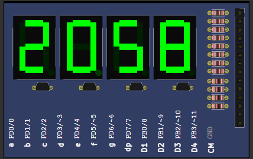

# # how-to Arduino

### Utilizando o ATMEGA328 com 4 Displays LED de 7 segmentos para criar um contador auto reiniciável de uma hora. 
 

* Utilização de registradores
* Baixa memória
* Baseado em incrementação com delay

# # 

   
  Print do contador no PICSimLab

